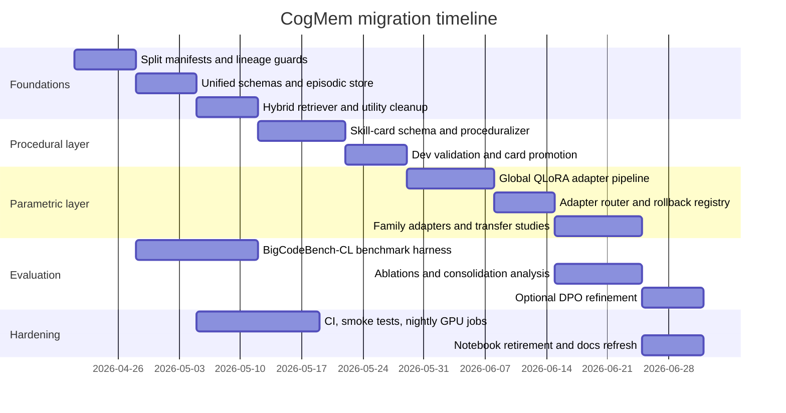

# Toward Human-Like Memory for Continual Coding in Qwen2.5-3B

## Executive Summary

Implementation follow-up: see [implementation-checklist.md](F:/Newgeneration/CogMem/docs/implementation-checklist.md) for the concrete repo task list derived from this report.

The connected repo audit shows that **CogMem is already doing more than simple chat-history replay**. It has a BigCodeBench runner and collector that persist task episodes and trajectories, a sequential memory bank that combines semantic similarity with learned utility, an experience summarization path, a cluster-memory system that groups related coding experiences, and local LoRA/QLoRA training code for turning selected experiences into trainable artifacts. In other words, the repo already contains the seeds of **episodic memory**, **partial proceduralization**, and **early parametric compression**. But those three layers are not cleanly separated yet, and that is the core reason the system still feels like “text and retrieval” rather than genuine skill growth. fileciteturn31file0L1-L1 fileciteturn32file0L1-L1 fileciteturn34file0L1-L1 fileciteturn36file0L1-L1 fileciteturn27file0L1-L1 fileciteturn33file0L1-L1

The literature points to a very clear conclusion. **MemRL** shows how to make episodic retrieval less noisy by learning utility from outcomes rather than relying on semantic similarity alone. **Skill-Pro**—the current arXiv title for the work often referenced as ProcMEM—shows how to convert episodes into reusable executable skills with activation, execution, and termination conditions. **Voyager** shows the power of an ever-growing executable skill library. **ParamMem/ParamAgent** shows that some cross-sample reflective patterns can be compressed into a small parametric component. **Mem-α** shows that what to store, how to structure it, and when to update it can themselves be trained. **Memory Transfer Learning** shows that high-abstraction coding memories transfer far better than raw traces. The best idea for your goal is therefore **not** “MemRL only,” and **not** “QLoRA only.” It is a **causal three-level ladder**: **episodes → skill cards → adapters**. citeturn2view0turn2view1turn6view0turn8view1turn9view0turn11view0

For a non-coder **Qwen2.5-3B-Instruct**, the practical path is to keep the base model frozen, let it accumulate coding experiences on a contamination-safe train split, promote only repeatedly useful episodes into **procedural skill cards**, and compress only the most transferable cards into **small QLoRA adapters**. That is how the model gets “smarter from memory”: not by stuffing more text into prompts, but by allowing repeated successful procedures to graduate from retrieval-time hints into reusable behavior priors. QLoRA is the right compression mechanism on one entity["company","NVIDIA","gpu vendor"] A4000 because it preserves the frozen base, uses 4-bit quantization, and was explicitly designed to backpropagate through a frozen quantized model into LoRA adapters with low memory overhead. citeturn5view0

There is also a crucial evaluation caveat. **BigCodeBench is a benchmark, not a training corpus**. Its paper reports 1,140 tasks, 139 libraries, 7 domains, and near-100% branch coverage, while the dataset card also exposes fields like `canonical_solution` and `test`. That means you can absolutely use it for **internal continual-learning research** by creating a strict held-out split, but you should label those results as a **BigCodeBench-CL split**, not as an official leaderboard score. The repo’s own builder and trainer paths currently make it too easy to turn benchmark episodes into training data without lineage guards, so contamination controls need to be the first migration step. citeturn3view1turn14search0turn14search3 fileciteturn26file0L1-L1 fileciteturn33file0L1-L1

## Repo Audit

Enabled connector inventory for this request: entity["company","GitHub","developer platform"] only. In the accessible repo snapshot, I found `paperspace_patches.ipynb` and related experiment notebooks, but I did **not** locate a committed `paperspace_patches.html` artifact. For this audit, the notebook had to be treated as the ground-truth experiment record for that branch of the project. fileciteturn29file8L1-L1 fileciteturn30file0L1-L1

The repo currently has **two partially overlapping memory architectures**. The first is the sequential collector path: it runs BigCodeBench tasks, embeds each task description, retrieves prior successful memories, injects them as few-shot experience, and updates memory utility based on task outcomes. The second is the more ambitious patch path: it forms episode clusters from pass/fail contrasts, computes hidden-state directions or patch candidates from those clusters, scores them with promotion/use heuristics, and tries to apply one or more retrieved patches during inference. This is promising, but it also means the repo is currently split between a **text-memory runtime** and a **representation-edit runtime**, rather than one unified ladder. fileciteturn32file0L1-L1 fileciteturn36file0L1-L1 fileciteturn30file0L1-L1

The sequential path is the clearest example of current episodic memory. `collect_sequential.py` stores a `MemoryItem` with task description, generated code, outcome, embedding, usage count, and a learned `q_value`; retrieval first ranks by cosine similarity and then reranks by a weighted blend of similarity and utility; only successful retrieved items are shown to the model; and tasks are processed sequentially so later steps can benefit from earlier experience. That is already much more interesting than raw RAG, and conceptually it is the closest part of the repo to **MemRL-style utility-aware episodic retrieval**. The problem is that utility is still too coarse: it is updated from task success or failure, not from a true estimate of whether the retrieved memory actually caused the success. fileciteturn32file0L1-L1 citeturn2view0

The patch path is more novel. The notebook builds a local 4-bit Qwen2.5-3B stack, records successful and failed attempts, groups them into “cluster memories,” computes applicability and use scores, and distills trainable patch artifacts from clusters. The associated `cogmem/patches/memory_bank.py` dataclasses show that cluster memories already mix together summary statistics, structural markers, contrast pairs, transfer-gain signals, support counts, and patch IDs. This is a meaningful step beyond flat memorization, because the unit of memory is no longer only the original text episode. But it still does **not** yet amount to procedural memory in the strong sense: there is no explicit skill schema with triggers, preconditions, termination conditions, or validation recipes, and retrieval is still mostly governed by prompt similarity plus heuristic scoring. fileciteturn36file0L1-L1 fileciteturn30file0L1-L1

The empirical status is encouraging but incomplete. The repo’s baseline markdown reports **22.3% pass@1** for Qwen2.5-3B on the full BigCodeBench run, establishing a real starting point. The patch notebook records that the 4-bit base load left about **12.8 GB free** on a 16 GB A4000, then built a small proof-of-concept bank with **42 episodes, 6 memories, and 6 patches**. In the notebook’s small “seen” sweep, **top-k = 1** improved success from **30% to 50%**, with 6 helped and 0 hurt, while larger multi-memory settings were worse. That is exactly the kind of signal you want from an early experiment: there appears to be transferable signal, but it is fragile, and interference rises quickly when multiple memories are injected together. The larger evaluation path in the notebook was not yet finished cleanly. fileciteturn28file0L1-L1 fileciteturn30file0L1-L1

A second important finding is that the repo’s **utility semantics are inconsistent across modules**. In one place, `q_value` is a binary success marker; in another, it is initialized at 0.5 and updated like a soft utility; in the baseline report, it is described as 1/-1 early-cycle feedback; and in the training-data builder it is converted into copy counts. That inconsistency matters because the project is trying to use one number for too many different concepts: “current task success,” “estimated retrieval helpfulness,” “training example weight,” and “promotion score.” Those are not the same thing. fileciteturn31file0L1-L1 fileciteturn32file0L1-L1 fileciteturn28file0L1-L1 fileciteturn26file0L1-L1 fileciteturn36file0L1-L1

The table below is my synthesis of the repo’s current position against the memory ladder you care about. It is based on the runner, sequential collector, experience summarizer, local trainer, patch-memory bank, and the `paperspace_patches` notebook. fileciteturn31file0L1-L1 fileciteturn32file0L1-L1 fileciteturn34file0L1-L1 fileciteturn27file0L1-L1 fileciteturn36file0L1-L1 fileciteturn30file0L1-L1

| Ladder level | What CogMem already has | What is still missing | Audit verdict |
|---|---|---|---|
| Episodic | Stored attempts, trajectories, embeddings, retrieval lineage, utility-like scores, pass/fail contrast examples | Counterfactual memory credit, unified utility schema, stricter split lineage, richer code/error features | Strongest layer |
| Procedural | Experience summaries, cluster memories, structural markers, transfer stats, patch candidates | Explicit skill cards, triggers, preconditions, validation plans, anti-pattern rules, state/action abstractions | Partial and implicit |
| Parametric | Local LoRA/QLoRA training, SFT/DPO path, cluster-based patch distillation | Adapter registry, router, rollback/replay, contamination-safe manifests, stable family-level consolidation | Early and fragile |

The biggest architectural gap is therefore very specific: **CogMem can retrieve experiences, and it can sometimes compress them, but it does not yet have a first-class representation for “know-how.”** That is the missing bridge between “memory” and “becoming smarter.”

## What the Literature Actually Solves

Human memory research does **not** treat memory as one flat bucket. Standard neuroscience references distinguish declarative memory from procedural memory, and also distinguish episodic memory from other declarative forms. Procedural memory is skill-like and often not consciously retrievable in detail, while declarative memory is reportable and language-accessible. That does not map literally onto LLMs, but it is a useful engineering guide: coding agents should not store everything as the same textual object if the objective is to grow reusable skill. citeturn13view0turn10search6turn12search7

The current agent-memory papers each solve **one piece** of that problem. **MemGPT** solves memory *paging*: how to move data across tiers so long contexts fit into a limited window. **Reflexion** and **ExpeL** solve memory *reflection*: how to turn task feedback into reusable natural-language insights without changing model weights. **MemRL** solves memory *selection*: how to retrieve high-utility episodes rather than semantically similar noise. **Skill-Pro/ProcMEM** solves memory *proceduralization*: how to convert trajectories into executable skills with activations and terminations. **Voyager** solves *runtime skill reuse* with an ever-growing code skill library. **ParamMem/ParamAgent** solves *small parametric reuse* by storing reflective patterns in parameters. **Mem-α** solves *memory construction policy*: what to store, how to structure it, and when to update it. **Memory Transfer Learning** solves *transfer diagnosis* for coding agents and shows that abstraction level is the decisive variable. citeturn3view0turn5view1turn8view0turn2view0turn2view1 citeturn6view0turn8view1turn9view0turn11view0

The comparison below distills those mechanisms into what matters for your repo. citeturn3view0turn5view1turn8view0turn2view0turn2view1 citeturn6view0turn8view1turn9view0turn11view0

| Method | Memory object | Utility or consolidation mechanism | Most useful lesson for CogMem |
|---|---|---|---|
| MemGPT | Text in hierarchical tiers | Paging and interrupts | Good for long context, weak for skill growth |
| Reflexion | Reflection strings | Verbal reinforcement from feedback | Good repair loop, weak compression |
| ExpeL | Insights plus prior experiences | Offline knowledge extraction | Good first proceduralizer |
| MemRL | Episodic items with learned values | Two-phase retrieval and runtime RL | Best starting point for episodic utility |
| Skill-Pro / ProcMEM | Executable skills | Skill-MDP, PPO gate, score maintenance | Best template for procedural memory |
| Voyager | Executable code skills | Reusable skill library plus iterative prompting | Strong evidence for code-as-procedure memory |
| ParamMem / ParamAgent | Parametric reflective memory | Cross-sample reflective pattern encoding | Best evidence for small parametric memory |
| Mem-α | Structured multi-part memory | RL for what/how/when to store | Best write-policy inspiration |
| Memory Transfer Learning | Trajectory, workflow, summary, insight | Cross-domain retrieval study | High-level insights transfer far better than raw traces |

Three design laws emerge from these papers.

First, **similarity is not enough**. MemRL’s central contribution is to show that even good semantic retrieval remains noisy unless retrieval is reweighted by learned utility from environment feedback. That maps directly onto your repo: the sequential bank is directionally correct, but it should learn “did this memory help?” not merely “was it retrieved before a success?” citeturn2view0 fileciteturn32file0L1-L1

Second, **raw traces are not the best transferable representation**. MTL’s 2026 coding-agent study is extremely relevant here: the average cross-domain improvement came from **abstract insight memories**, while low-level traces could induce negative transfer. That is a strong argument **against** making per-episode patches the long-term production memory. It is an argument **for** using raw traces only as substrates from which to build more abstract skill cards. citeturn11view0

Third, **procedural memory should be executable before it becomes parametric**. Skill-Pro and Voyager both point in this direction: the system improves more reliably when it accumulates reusable procedures, not just summaries. ParamMem then suggests that once such patterns are stable across many samples, a small learned parametric component can compress them further. This is the best answer to your question about “how memory makes the model smarter”: memory should not jump directly into weights. It should become **validated procedure first**, then **compressed parameter**. citeturn2view1turn6view0turn8view1

## A Revised Memory Ladder for Qwen2.5-3B

The strongest architecture for your constraints is what I would call a **Causal Memory Ladder**. It is “causal” because promotion depends on measured help, not just similarity or frequency. It is a “ladder” because each layer has a different memory object and a different promotion rule.

```text
task
  -> episode record
      -> utility update
          -> skill-card induction
              -> dev-set validation
                  -> adapter training
                      -> router-controlled inference
```

At inference time, the base model should remain frozen and unchanged. A coding query triggers retrieval from the episodic and procedural stores; if the router is confident, it also activates a global coding adapter and optionally one family adapter. After the attempt, the system records a new episode and updates utility. During “micro-sleep,” it abstracts recent episodes into candidate skill cards. During “deep-sleep,” it trains or refreshes adapters from only the most stable skill clusters. This is much closer to the declarative/procedural distinction in human memory than the current flat text-plus-patch mix, and it is also consistent with coding-agent evidence showing that abstract skill-like memory transfers best. citeturn13view0turn12search0turn11view0

### Components and APIs

The minimum viable component set is small:

```python
record_episode(task_id, prompt, code, tests, outcome, retrieved_ids, adapter_ids, metadata)
retrieve_episodes(query, top_k=20, filters=None)
induce_skill_cards(episode_ids, dev_task_ids)
validate_skill_card(card_id, dev_task_ids)
train_adapter(family_id, manifest_id, rank=8)
route(query) -> {"cards": [...], "adapters": [...]}
```

The crucial semantic change is to replace the repo’s overloaded `q_value` with three separate metrics: `episode_helpfulness`, `card_transfer_gain`, and `adapter_dev_gain`. That one schema change will make the whole codebase much easier to reason about, because it aligns each memory layer with its own objective. The need for that separation is directly visible in the current repo, where `q_value` is being used simultaneously as retrieval score, training weight, success marker, and promotion hint. fileciteturn31file0L1-L1 fileciteturn32file0L1-L1 fileciteturn26file0L1-L1 fileciteturn36file0L1-L1

### Episodic store format comparison

The comparison below is a practical engineering choice for one machine, not a research claim. It is meant to replace the repo’s current mix of ad hoc JSON, notebook-only artifacts, and multiple bank implementations. The recommendation is based on the repo’s current scale and the fact that BigCodeBench itself is only 1,140 tasks, so retrieval complexity is modest at first. fileciteturn32file0L1-L1 fileciteturn36file0L1-L1 citeturn3view1turn14search0

| Episodic format | Strengths | Weaknesses | Recommendation |
|---|---|---|---|
| Flat JSONL bank | Simple, debuggable | Painful joins, weak schema evolution, hard lineage checks | Good only for exports |
| SQLite + FAISS + Parquet blobs | Strong metadata filtering, easy lineage, cheap local deployment, simple backups | Slightly more engineering | **Best fit** |
| DuckDB + FAISS | Great analytics, columnar scans | More awkward online writes | Good secondary analytics layer |
| Vector DB only | Easy similarity search | Weak transactional guarantees, opaque lineage | Do not use as source of truth |

I recommend **SQLite for metadata**, **FAISS on CPU for embeddings**, and **Parquet for bulky trace exports and training manifests**. Each episode should retain task ID, split, prompt hash, library tags, AST fingerprint, error family, validation recipe, final outcome, retrieved memory IDs, and adapter IDs. That gives you the hooks for causal credit assignment later.

### Procedural card schema comparison

This comparison is where MTL, Skill-Pro, Voyager, and the repo’s own `experience_summary.py` are most relevant. The repo already knows how to produce natural-language summaries, but the literature strongly suggests that useful long-term coding memory must become **structured and executable**, not merely descriptive. fileciteturn34file0L1-L1 citeturn2view1turn6view0turn11view0

| Schema type | Typical fields | Pros | Cons | Recommendation |
|---|---|---|---|---|
| Free-text summary | summary, outcome, notes | Easy to generate | Weak triggers, hard validation, high prompt bloat | Too weak alone |
| Workflow card | trigger, steps, validation checklist, pitfalls | Transferable, readable, compact | Not fully executable | Good intermediate form |
| Skill DSL | activation, execution actions, termination, validator | Strongest procedural representation | More engineering effort | Best long-term target |
| Hybrid workflow + DSL | readable summary plus machine fields | Human-debuggable and machine-usable | Slightly larger schema | **Best fit** |

My recommendation is a **hybrid skill card** with these fields:

- `triggers`: libraries, error types, AST motifs, task families  
- `plan_steps`: ordered reusable procedure  
- `validation`: what to test before accepting the answer  
- `anti_patterns`: known failure modes  
- `evidence_episode_ids`: supporting episodes  
- `transfer_gain`: held-out dev gain  
- `confidence`: calibrated help estimate

This directly answers the “how do we make the model smarter from memory?” problem. The model should first learn a reusable **procedure** such as *“when modifying file transforms, add a minimal inline validation harness and test the exact edge case before finalizing”*. That kind of meta-procedure is exactly the sort of transferable coding memory MTL found to be effective. citeturn11view0

### Parametric adapter options and A4000 resource estimates

The planning numbers below are **estimates**, but they are grounded in two things: the repo’s measured 4-bit load in the `paperspace_patches` notebook, and the QLoRA paper’s design for low-memory adapter training. The key operational fact is that the notebook left about 12.8 GB free after the 4-bit base load, which suggests that careful adapter training is feasible but that long-sequence, high-batch runs will be tight. fileciteturn30file0L1-L1 citeturn5view0

| Adapter option | Scope | Likely fit on 16 GB A4000 | Best use | Recommendation |
|---|---|---|---|---|
| No adapters | Retrieval only | Safe | Baseline and ablations | Required baseline |
| Global coding adapter, rank 8 | Broad coding priors | Comfortable | First parametric milestone | Good |
| Global coding adapter, rank 16 | Broader coding priors | Tight but realistic | Main coding uplift | **Best target** |
| Family adapter bank, rank 8 each | Data wrangling, regex, IO, testing, etc. | Fine if loaded one-at-a-time | Specialized lift | Good second phase |
| Patch-per-memory inference | One patch per cluster | Interference grows quickly | Research probe only | Not production |
| DPO refinement | Preference tuning on contrast pairs | Marginal on 16 GB, high-risk | Final polish only | Optional late experiment |

My concrete regimen would be:

- Keep the base model frozen and 4-bit quantized.
- Start with **QLoRA rank 16** for one global coding adapter.
- Target `q_proj, k_proj, v_proj, o_proj, gate_proj, up_proj, down_proj`, matching the repo’s current trainer direction. fileciteturn27file0L1-L1
- Use `batch_size = 1` or `2`, `gradient_accumulation = 8–16`, and `max_seq_len = 1536` initially. The repo’s current `batch_size = 4` and `max_length = 2048` settings are plausible as notebook targets, but for stable A4000 operation they are likely too aggressive once activations and optimizer state grow. This is an inference from the trainer config and the measured notebook headroom. fileciteturn27file0L1-L1 fileciteturn30file0L1-L1
- Do **not merge** coding adapters back into the base. Route them only for detected coding tasks. That preserves the original general-instruct behavior.
- Only add **family adapters** after the procedural layer is stable and you have enough evidence that one family really benefits from separate compression.
- Treat DoRA as an optional follow-up if rank-16 LoRA underfits; the repo already has that switch, and NVIDIA’s paper argues for improved capacity and stability without inference overhead. fileciteturn27file0L1-L1 citeturn4search3

The most important design choice here is philosophical as much as technical: **do not compress raw episodes into parameters**. Compress only **promoted skill cards** with positive transfer gain.

## Experimental Design Without Contamination

Because BigCodeBench includes public prompts, tests, and canonical solutions, you need two distinct evaluation labels. The first is an **official baseline label**, which should remain zero-shot or external-data-only. The second is your **internal continual-learning label**, which I suggest naming **BigCodeBench-CL**. That split should be the one you use for all memory and adapter experiments. Otherwise, the moment benchmark tasks enter the memory bank and then flow into `build_training_data_bigcode.py` or the SFT/DPO path, the evaluation becomes benchmark-adaptive rather than benchmark-held-out. citeturn14search0turn14search3turn3view1 fileciteturn26file0L1-L1 fileciteturn33file0L1-L1

I recommend a stratified split over task IDs using the benchmark’s domain and library metadata:

- **Train-online:** 60%
- **Dev-route:** 20%
- **Test-holdout:** 20%

Stratify by `libs`, prompt length, and inferred task family so you do not accidentally put one library-heavy cluster entirely into one partition. The current notebook’s “first 100 / remaining 1040” split is a useful prototype, but it is too brittle to serve as the long-term research protocol. fileciteturn30file0L1-L1 citeturn14search0turn14search3

The core evaluation dashboard should include the following metrics:

| Metric | Definition | Why it matters |
|---|---|---|
| pass@1 | Single-sample execution success on holdout | Main skill measure |
| pass@3 | Best of three fixed-budget samples | Measures repair/search headroom |
| Repair rounds to success | Mean number of retries before first pass | Captures real coding efficiency |
| Retrieval helpfulness@k | Fraction of retrieved memories whose removal lowers success on sampled A/B runs | Measures causal usefulness |
| Consolidation gain | Holdout delta after procedural or parametric consolidation relative to episodic-only | Measures “getting smarter,” not just retrieving more |
| Negative transfer rate | Fraction of tasks worsened by memory or adapters | Detects brittle overfitting |
| Adapter routing precision | Fraction of routed activations that actually help on dev | Prevents unnecessary adapter usage |

The ablation ladder should mirror the memory ladder:

| Setting | Description |
|---|---|
| Base | Frozen Qwen2.5-3B-Instruct, no memory |
| Episodic-sim | Similarity retrieval only |
| Episodic-utility | Similarity plus learned utility |
| Procedural | Episodic plus validated skill cards |
| Param-global | Procedural plus global coding adapter |
| Param-family | Global plus family adapters |
| Transfer-on | Cross-family memory pool enabled |
| Transfer-off | Only same-family memory allowed |
| DPO-on | Preference refinement enabled |
| DPO-off | SFT-only adapter |

The success criteria should also be phased, not all-or-nothing. A reasonable bar is:

- **Milestone one:** episodic-utility beats Base on holdout by **at least 3–4 absolute pass@1 points**.
- **Milestone two:** Procedural beats episodic-utility by **at least 2 more points** and improves retrieval helpfulness@3.
- **Milestone three:** Param-global beats Procedural by **another 2–3 points** without increasing negative transfer.
- **Milestone four:** family adapters justify themselves only if they beat the single global adapter on at least two families and keep routing precision high.

That is ambitious enough to matter and realistic enough for one GPU.

## Migration Roadmap

The current codebase should be refactored around one principle: **notebook experiments must become typed, lineage-safe package modules**. The repo already contains the right raw ingredients, but they live in parallel scripts, notebooks, and separate memory abstractions. The migration goal is to turn those experiments into a single reproducible pipeline. fileciteturn32file0L1-L1 fileciteturn34file0L1-L1 fileciteturn36file0L1-L1 fileciteturn27file0L1-L1 fileciteturn30file0L1-L1

The concrete code-change map should look like this:

| Area | Existing files | Change |
|---|---|---|
| Split management | notebooks and scripts | Add `cogmem/benchmarks/bigcodebench/splits.py` with manifest hashing and leakage guards |
| Episodic memory | `collect_sequential.py`, current banks | Add `cogmem/memory/episodic_store.py` and `schema.py`; unify utility semantics |
| Procedural memory | `experience_summary.py`, patch bank | Add `cogmem/memory/skill_store.py` and `cogmem/consolidation/proceduralize.py` |
| Retrieval | current semantic rerankers | Add hybrid retriever with sparse, dense, structural, and utility scoring |
| Parametric memory | `train_lora_local.py`, `train_generator.py` | Add `adapter_registry.py`, routed loading, rollback, and manifest-aware training |
| Evaluation | runner and notebooks | Add causal A/B harness, consolidation-gain evaluator, split-aware leaderboard labels |
| Testing | existing benchmark tests | Add serialization, leakage, retrieval, and adapter smoke tests |
| CI | ad hoc | Add CPU CI plus self-hosted GPU nightly smoke |

A sensible implementation timeline is:



The final migration checklist should be short and strict:

- Create split manifests **before** any new training run.
- Replace generic `q_value` with layer-specific utility metrics.
- Convert `paperspace_patches.ipynb` logic into package modules and tests.
- Keep cluster patches as **research probes**, not long-term production memory.
- Add hybrid retrieval and top-k default of **1** until causal helpfulness improves.
- Promote only validated skill cards into the adapter trainer.
- Keep adapters unmerged and routed only for coding tasks.
- Use entity["company","Hugging Face","ml platform"] dataset manifests plus your own split registry to guarantee that no holdout task ID enters memory or training artifacts.
- Run CPU CI on every push and a self-hosted GPU smoke test nightly.
- Report internal continual-learning numbers as **BigCodeBench-CL**, not as official benchmark leaderboard numbers. citeturn14search0turn14search3turn3view1

The most actionable roadmap, in one sentence, is this: **use MemRL to decide which experiences matter, use Skill-Pro and MTL to turn them into transferable procedures, and use QLoRA to compress only the procedures that repeatedly prove they help**. That is the cleanest path from “memory as text” to “memory as skill” for a small general model learning to code from experience. citeturn2view0turn2view1turn11view0turn5view0
